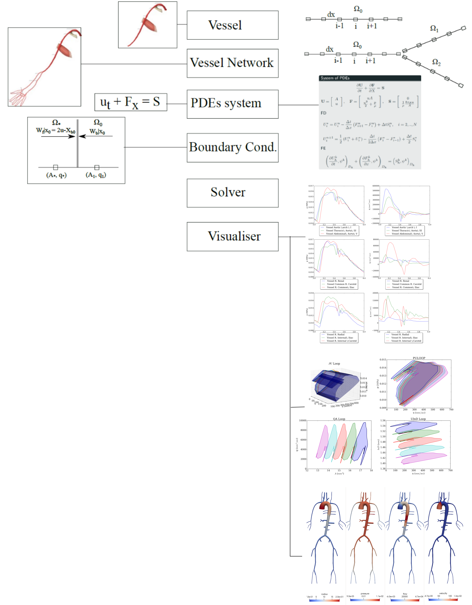

# PylseWave


### A Python package to solve pulse wave dynamics in arterial networks

The following diagram depicts the rationale along with the structure of the package



A c/python library to solve 1D pulse wave propagation in blood vessels or any hyperbolic PDE system in the form of


### Purpose
This library is designed to solve efficiently pulse wave dynamics in human arteries. It is written in python, cython and there are some c++ classes.

### Solver Example
```python
# ---- SOLUTION WITH CYTHON CLASSES ----- #
from pulsewavepy.cynum import cPDEsWat, BCsADAN56, cMacCormackSolver

myPDEs = cPDEsWat(vesssel_network)
myBCs = BCsADAN56(myPDEs, q_inlet_bc.eval_spline)

U0_vessel = np.array([0],dtype=np.int)
UL_vessel = np.array(terminal_vessels.keys())
UBif_vessel = np.array(bif_vessels)
UConj_vessel = np.array(conj_points)

mySolver = cMacCormackSolver(myBCs)
mySolver.set_T(dt=dt, T=T, no_cycles=tc)
mySolver.set_BC(U0_vessel, UL_vessel, UBif_vessel, UConj_vessel)
# ------- SOLVE AND TIME --------------- #
mySolver.solve(casename, myCallback, cfl_n=0.6, stability_safety_factor=1.0)
myCallback.close_file(casename)
```